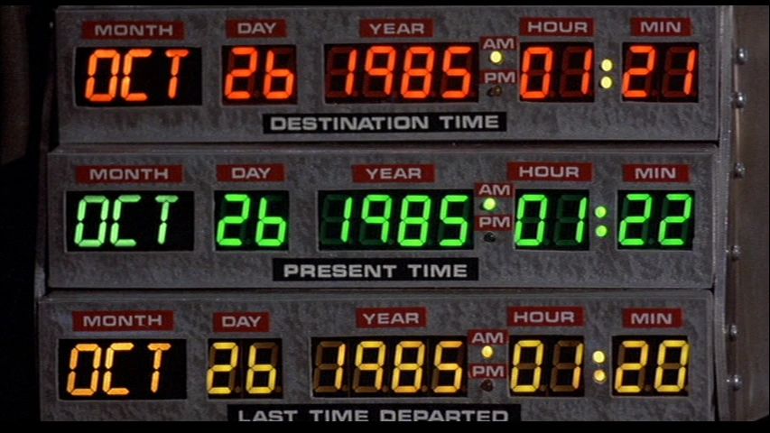

# DIT DDaT Tech Test 2023

## To download the repo on your machine:
---
1. Open your CLI
2. Clone this repository to your local machine by running the following command:  
   `git clone https://github.com/nicopicchio/DIT-DDaT-tech-test-2023.git`
3. Change directory to the folder just downloaded with:  
   `cd DIT-DDaT-tech-test-2023/`
4. Ensure your `main` branch is up-to-date using the following command:  
   `git pull https://github.com/nicopicchio/DIT-DDaT-tech-test-2023.git`
5. Run the `npm install` command to install project dependencies (Jest)

## To test the app:
---
1. Open the project in your code editor
2. Inside the `/src` directory you will find two files: `parse.js` and `utils.js`
   - The `parse.js` file contains the `parse()` function.
   - The `utils.js` file contains the support functions used by `parse()`
3. Inside the `/test` directory you fill find the `parse.test.js` file which contains the test suite for the app
   - To execute the test suite run `npm test` in your CLI
4. To test the `parse()` function run `node src/parse.js` || `node parse.js` (depending on your current directory) in your CLI
5. On lines 48-53 of the `parse.js` file I left some `console.log()` to show some examples
